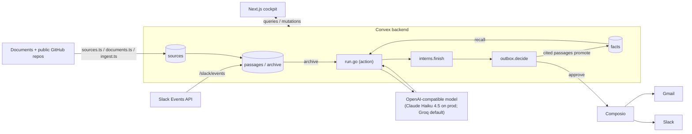

# Intern

A public community brain for AI agents, at [intern-brain.vercel.app](https://intern-brain.vercel.app).
Sign in with GitHub and you're in the same brain as everyone else. Brief an
intern in one sentence and it recalls what the community already knows — facts
plus passages from a searchable archive — then drafts exactly one outbound
email or Slack message and stops. It never asks questions; anything it can't
settle becomes a `[placeholder]` you fill in before approving. Once you've
connected your own Gmail or Slack (through Composio), approving a draft sends
it from your own account. Edit a draft before approving and the edit becomes a
fact the next intern reads first — that's the whole learning loop. Outside
briefs, the community Slack's public channels, documents (a link, an upload or
a PDF) and public GitHub repos all feed that same archive automatically; a
🧠 reaction, the promote button, or an approved draft that cited a passage
turns it into a fact.

## Origin and credit

Started at a hackathon on 9 Aug 2026 as a two-person team: Andrew Wang
([AndrxwWxng/intern](https://github.com/AndrxwWxng/intern), the upstream this
repo forked from) and Mihir Sahu. Mihir has continued it solo since. The
hackathon build ran on a separate Python agent engine called Scout, built on
[Agno](https://github.com/agno-agi); that engine, VoiceOS and the original MCP
server are gone from this codebase, but the `scout/` directory itself — Agno's
own `agno-agi/scout` example, Apache-2.0 licensed — is still vendored in the
repo and unused by the current app. It's Agno's code, not Mihir's; see
`scout/LICENSE` and `scout/README.md`.

## What it does today

**A run.** `interns.spawn` (a mutation) checks the day's caps, inserts a row
and schedules `run.go` (an action). `run.go` recalls facts and archive
passages for the task, makes one streamed call to an OpenAI-compatible model
(`lib/model.ts`, plain `fetch`, no SDK), parses the reply for fact blocks and
an action block, and calls `interns.finish` — facts and a draft, in one
transaction. A run that throws lands in `interns.fail` instead, which still
records what the provider billed. There's no separate agent service, no
Python, no queue: it's one Convex action.

**Recall.** Two things feed the prompt: `facts.recall` (what the community has
taught the brain, including past corrections) and `facts.archive` (passages
from Slack, documents and GitHub that match the task). The intern cites both
kinds by id in its `sources`, never in prose.

**Sending.** An approved draft goes through `outbox.decide` to `send.ts`,
which calls Composio to send from the member's own connected Gmail or Slack.
Without a Composio connection, or without `COMPOSIO_API_KEY` /
`COMPOSIO_VERIFIER_URL` set on the deployment at all, approving still files
the decision but sends nothing (sandbox). A draft that cited archive passages
promotes them to facts on approval (`outbox.decide` → `sources.promoteCited`).

**Ingestion.** The community Slack's public channels arrive live through
`/slack/events` and a 90-day backfill; documents (a pasted link, a markdown
upload or a PDF) and public GitHub repos (README, issues, PRs) are read into
the same `sources`/`passages` tables by `convex/documents.ts` and
`convex/ingest.ts`. No model call is involved in ingestion — it's plain
fetching and chunking.

## Architecture



## Determinism and evals

Interns never ask questions — the prompt gives them no way to, and a missing
detail becomes a `[placeholder]` instead. If a reply asks anyway, or an
outbound-shaped brief comes back with no usable draft, `run.go` makes exactly
one code-enforced rewrite call telling it to draft with placeholders. A live
send is refused while any `[placeholder]` remains in the draft.

`npm run eval` runs 28 fixed briefs through the live prompt (`EVAL_LIVE=1` runs
them in "live" mode, as a fully connected member). On Claude Haiku 4.5,
2026-09-25, live-mode expectation match went from 15/28 to 28/28 with zero
questions asked. It exits non-zero if the action-block parse rate drops under
90% or more than a quarter of the briefs error out, so a model outage can't
read as a pass.

## Tests

```bash
npm test          # unit tests: caps, prompt, parsers, redaction — 143 passing
npx vitest run     # Convex functions via convex-test — 223 passing
```

(Counts as of this write-up; run them yourself to check current numbers.)

## Safety

**Caps**, all in `lib/caps.ts`, enforced inside mutations so two tabs can't
race past a limit: 5 briefs per person per UTC day, 1 intern working at a
time, 20 facts per person per day, 20 sends per person per day, 5 sources
added per person per day, and a $5/day model-spend budget shared by everyone.
`CAP_EXEMPT_HANDLES` (a Convex env var, comma-separated GitHub handles) skips
the per-member caps for the deployment owner's own testing; it never skips the
shared budget.

**Visibility.** Drafts, questions and sends are owner-only. Public briefs and
facts have email addresses redacted (`lib/redact.ts`) before anyone else sees
them. Private documents stay out of the graph, the feed and other members'
recall.

**Inbound.** `/slack/events` (the community Slack) and `/composio/webhook`
(the 🧠 reaction and the opt-in Gmail label) both verify a signature before
parsing anything — `lib/slack.ts`'s `verifySlack` and `lib/inbound.ts`'s
`verifyWebhook`. An unsigned or mis-signed call gets a 401.

**Fetching.** Adding a document by URL goes through `lib/ingest.ts`'s
`fetchDocument`, which rejects private/loopback addresses and re-checks every
redirect hop, so a link can't be used to reach an internal address.

**Composio.** Connections finish through Composio's callback identity
verification (`lib/composio.ts`), so a Connect Link can't be redeemed for
someone else's session.

## Run it locally

```bash
npm install
npx convex dev   # backend — one watcher at a time
npm run dev      # cockpit → localhost:3000
```

Env vars: copy `.env.local.example` to `.env.local` and run `npx convex dev`
to fill in the Convex URLs; everything else (the model key, GitHub sign-in,
Composio, Slack) is a Convex env var, not a `.env` file — see
`.env.local.example` and [`HANDOVER.md`](./HANDOVER.md) for what to set and
where each value comes from. `HANDOVER.md` also covers the full community
setup (Composio, the community Slack, Gmail, ingestion) end to end; this file
only summarizes what's live.

[`docs/HLD.md`](./docs/HLD.md) is the older, larger design this was cut down
from — read it as intent, not as a description of this code.
